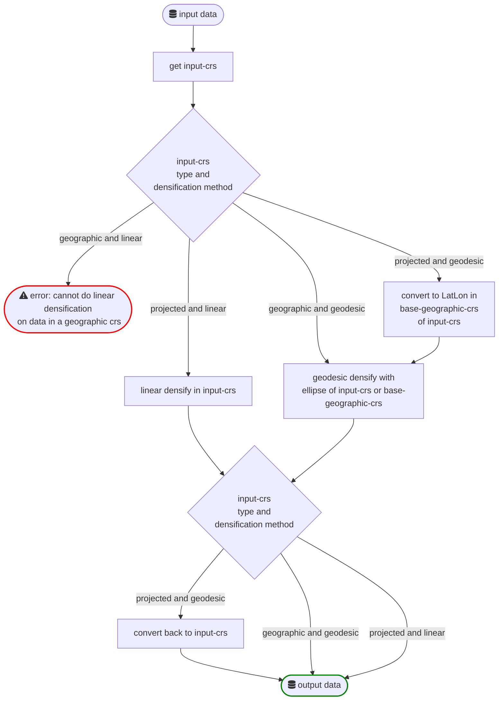

# geodense

[](https://geodetischeinfrastructuur.github.io/geodense/)

Python library and CLI tool to **check density** and **densify** linestring and polygon geometries using the geodesic (ellipsoidal great-circle) calculation.

Implementation based on [*Eenduidige transformatie van grenzen tussen ETRS89 en RD*](https://geoforum.nl/uploads/default/original/2X/c/c0795baa683bf3845c866ae4c576a880455be02a.pdf)

See the following flowchart for a highlevel schematic overview of the `densify` functionality of `geodense`:



## Installation

To install from source check out this repository and run from the root:

```sh
pip install .
```

## Development

> **TODO**: add description how to setup dev environment with conda/miniconda and libmamba solver, and install pyproj with: `conda install -c conda-forge  pyproj==3.6.0 --solver=libmamba`


Requires Python v3.9 or higher (due to dependency on [pyproj](https://pyproj4.github.io/pyproj/stable/) v3.6.0).

Install/uninstall for development:

```sh
pip install -e .
pip uninstall geodense
```

Install dev dependencies with:

```sh
pip install ".[dev]"
```

Check test coverage (install `coverage` with `pip install coverage` ):

```sh
python -m coverage run -p --source=src/geodense -m pytest -v tests && python -m  coverage report -m
```

## Usage CLI

Use either `geodense` or the short `gden` alias:

```txt
$ geodense --help

Usage: geodense [-h] {list-formats,densify,check-density} ...

Check density of, and densify geometries using the geodesic (ellipsoidal great-circle)
calculation for accurate CRS transformations

Commands:
  {list-formats,densify,check-density}

Options:
  -h, --help            show this help message and exit

Created by https://www.nsgi.nl/
```
